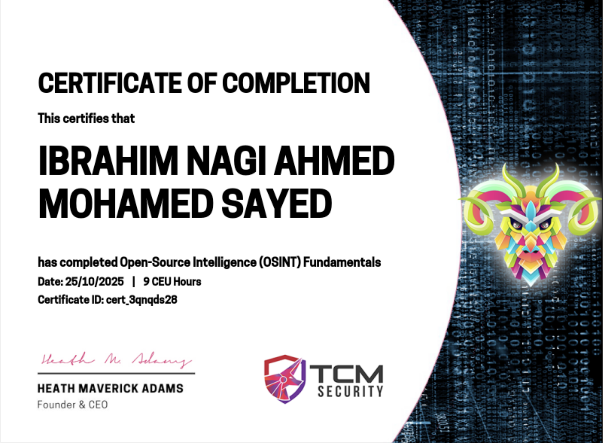
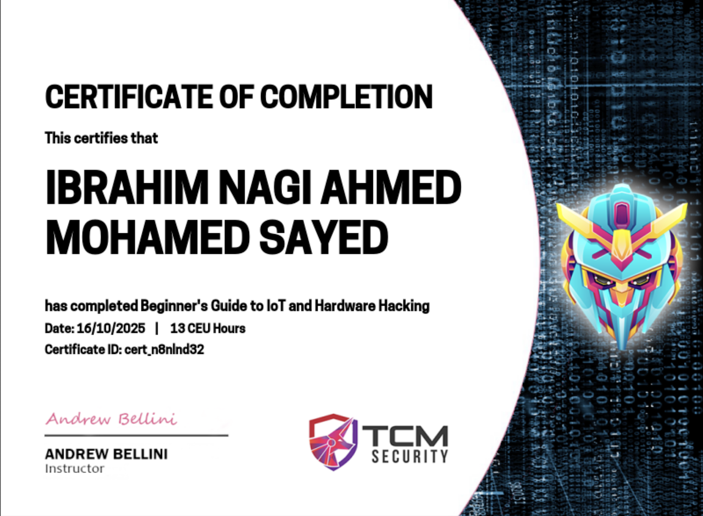
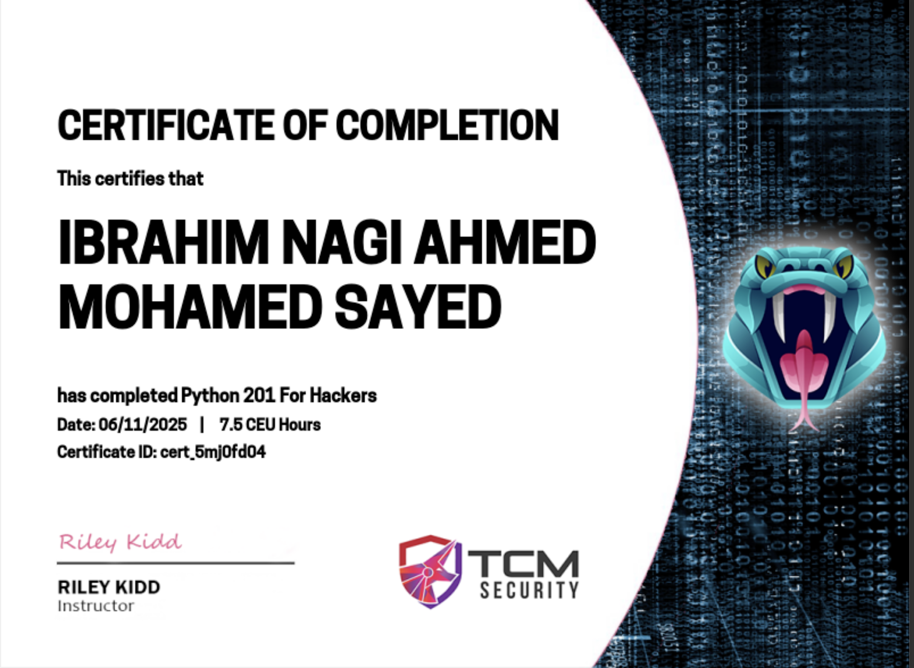
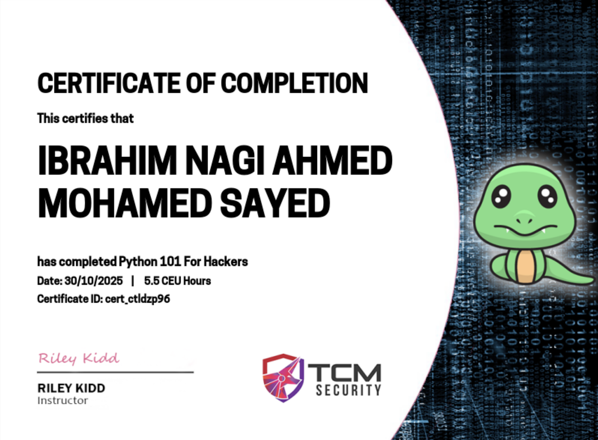
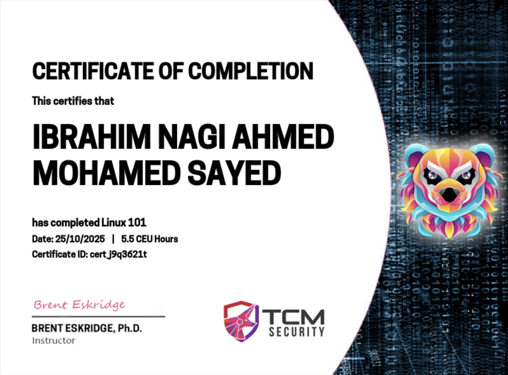

<!-- Avatar and Banner -->

<h1 align="center">
    
    
</h1>

 

🚀 Full-Stack Developer • Cloud & DevOps • Penetration Tester-in-Training • Robotics

  <a href="#about-me">About Me</a> •
  <a href="#tech-stack">Tech Stack</a> •
  <a href="#projects">Projects</a> •
  <a href="#certifications--education">Certifications & Education</a> •
  <a href="#contact">Contact</a>

---

## 📝 About Me

* 🎓 Final-year **Software Engineering** student at the University of Duisburg-Essen
* 💻 Full-Stack Developer building and operating **production systems for real clients**
* ☁️ Practical experience with **cloud infrastructure, CI/CD, and containerized deployments**
* 🤖 Built an autonomous **ROS2 navigation stack** for a mobile robot (SLAM, EKF, A*, Nav2)
* 🔐 Cybersecurity enthusiast: Hack The Box, TCM Security training, CTF challenges
* ♟️ Chess player, book lover, swimmer & horse riding enthusiast

---

## 🛠️ Tech Stack

### Languages

        

### Frameworks & Frontend

         

### Databases & Backend-as-a-Service

      

### Cloud, DevOps & Deployment

       

### Monitoring, Testing & Automation

      

### Version Control

  

### Robotics & Embedded (ROS2)

        

### Security & Pentesting

          

---

## 💼 Projects

### Freelance / Production

| Project | Description | Tech Stack | Link |
|---|---|---|---|
| **Café Cordes** | Production ordering & operations platform for a local café — online ordering, custom cake requests, admin panel | Next.js, TypeScript, PostgreSQL, Stripe, AWS S3, Playwright | [cordes-cafe.de](https://www.cordes-cafe.de) |
| **3D Anoubis** | Multilingual e-commerce & membership platform for 3D-printed products with AI-assisted live chat | Angular SSR, Spring Boot, PostgreSQL, Redis, Docker, n8n | [anoubis-store.com](https://www.anoubis-store.com/shop) |
| **Cyber Anoubis** | Business platform for a cybersecurity company — customer dashboard, consultation booking, AI chat | Angular SSR, Spring Boot, Stripe, GitHub Actions, Prometheus/Grafana | [anoubis-cyber.com](https://www.anoubis-cyber.com) |
| **EMRX Sicherheit** | Lead-generation website for a security services company with hardened contact form & local SEO | Angular SSR, Express, Zod, Railway | [emrxsicherheit.com](https://emrxsicherheit.com) |

### Academic / Personal

| Project | Description | Tech Stack | Link |
|---|---|---|---|
| **Autonomous Mobile Robot** | Bachelor project: full ROS2 navigation pipeline for a Husarion Panther UGV — SLAM, EKF, A*, frontier-based exploration, Nav2 | ROS2 Humble, Python, SLAM Toolbox, Nav2, Gazebo | *[Husarion_Panther](https://github.com/INagy80/Husarion_Panther)* |
| **SEP-Drive** | Ride-sharing app (university project, team lead) — real-time simulation, payments, chat | Spring Boot, Angular, WebSocket, JWT, Docker, PostgreSQL | *[SEP-Drive](https://github.com/INagy80/SEP-Drive)* |
| **Autonomous Security Research Drone** | Drone with 3D LiDAR + depth camera for SLAM-based area mapping, streamed to a cloud LLM for analysis — security research prototype | ROS2, Python, SLAM Toolbox, AWS, LLM APIs | *In development* |
| **Mario CV Controller** | Modified a game engine to control character movement via webcam hand/head tracking | Python, OpenCV, MediaPipe | *[Mario](https://github.com/INagy80/Mario)* |

> 🚧 More projects coming soon! 
> 🔗 *Links to repos will be updated here.*

---

## 🎓 Certifications & Education

* 🎓 Final-year **B.Sc. Software Engineering**, University of Duisburg-Essen (expected 2027)
* ☁️ AWS Cloud Practitioner, AWS DevOps Engineer, AWS Solutions Architect — *courses*
* 🎯 Working towards **CompTIA A+** & **CCNA**

##

---

## 🌱 What I'm Learning

* **Kubernetes** orchestration & **Kafka**-based microservice communication at scale
* Advanced **penetration testing** techniques & tools
* **Cloud security** on AWS
* **AI-assisted automation** (n8n workflows, LLM integration) in production systems

---

### 📊 My GitHub Stats

 

  
  
   
  

  

 

 

---

## 📫 Contact

  
  
  

---

<h3 align="center"> -> "Ethical hacking is not just a skill. It's a mindset." </h3>

---

 
<h1 align="center">
    
</h1>
 
